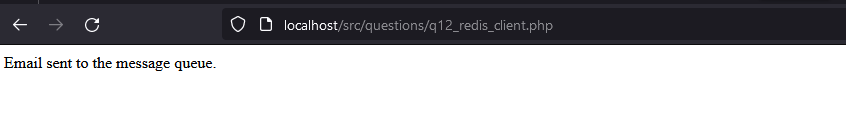
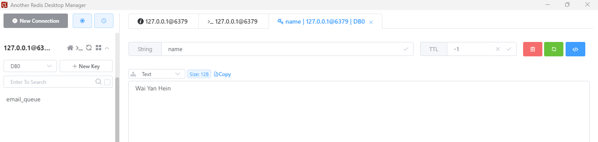
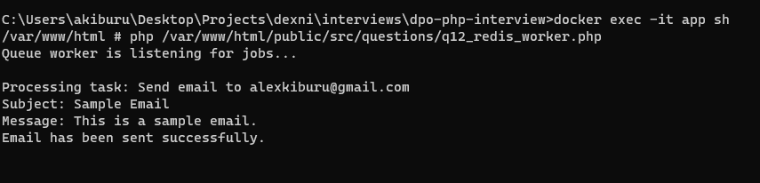

# dpo-php-interview
This is a PHP Interview Code with task solutions that run on docker and interact with Redis and MySQL.

### Run Instructions
`$ docker compose up`

### Go to browser and confirm that the application is running with a description of "Hello World!"
`http://localhost`

### To confirm the question with answers
Access the app/public/src/questions folder and you'll find php files with names starting with question numbers in the format of questionNumber_description.php e.g q2_oop.php

Beginning of every question's file is a description of the original question.

### How to run the files on the browser
`http://localhost/src/questions/q2_oop.php`

### How to run question 12 - queue and worker
To send the email request

`http://localhost/src/questions/q12_redis_client.php`

Task to appear in queue in Redis Desktop Manager

Run the worker to consume the email task

`$ docker exec -it app sh`

`php /var/www/html/public/src/questions/q12_redis_worker.php`

